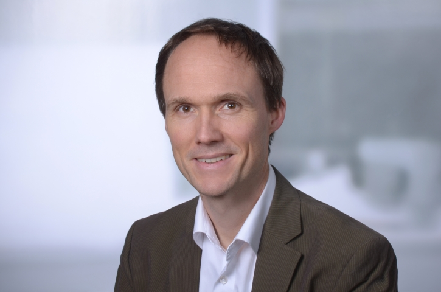

```{r, echo=FALSE, out.width="40%", fig.align="center"}

```

```{r setup, include=FALSE}
knitr::opts_chunk$set(echo = FALSE, warning = FALSE, message = FALSE)
library(vitae)
library(scholar)
library(data.table)
```

---


# Berufserfahrung

```{r}
readxl::read_excel(
  "hewag1975cv_de.xlsx"
  , sheet = "profession"
) |> 
  detailed_entries(
    what = role
    , when = year
    , with = company
    , why = responsibilities
  )
```

# Ausbildung

```{r}
readxl::read_excel(
  "hewag1975cv_de.xlsx"
  , sheet = "education"
) |> 
  detailed_entries(
    what = degree
    , when = year
    , with = institution
    , why = subject
  )
```

# Kenntnisse

```{r}
readxl::read_excel(
  "hewag1975cv_de.xlsx"
  , sheet = "skills"
) |> 
  detailed_entries(
    what = tool
    , when = year
    , why = expertise
  )
```

---

```{r, echo=FALSE}
knitr::include_graphics(
  c(
    "pic/rstudio.png"
    , "pic/R.png"
    , "pic/shiny.png"
    , "pic/quarto.png"
    , "pic/git.png"
    , "pic/github.png"
    , "pic/gitlab.png"
  )
  , dpi = 300
)
```

```{r, echo=FALSE}
knitr::include_graphics(
  c(
    "pic/ubuntu.png"
    , "pic/docker.png"
    , "pic/sql.png"
    , "pic/aws.png"
    , "pic/python.png"
  )
  , dpi = 300
)
```

---

# Über mich

Programmieren, Daten und Datenanalyse spielen in meinem Leben eine große Rolle - 
beruflich und auch in kleineren privaten Projekten. Darüber hinaus habe ich aber 
auch noch andere Leidenschaften. Mit meiner Familie erkunde ich gerne (und oft 
mit der Bahn ;-)) die nähere und weitere Umgebung und wir reisen gerne zu 
(geographisch) spannenden Orten, wie z.B. in diesem Jahr nach Island. 
Außerdem bin ich begeisterter Kletterer und Bergsteiger und in diesem Bereich auch ehrenamtlich 
als Trainer und Ausbildungsreferent im Deutschen Alpenverein tätig.

---

# Publikationen

```{r}
pub = get_publications("W9QpphMAAAAJ") |> 
  as.data.table()
pub = pub[year > 2005]
pub = pub[order(year, decreasing = TRUE)]

detailed_entries(
    pub
    , what = title
    , when = year
    , with = author
    , where = journal
  )
```

